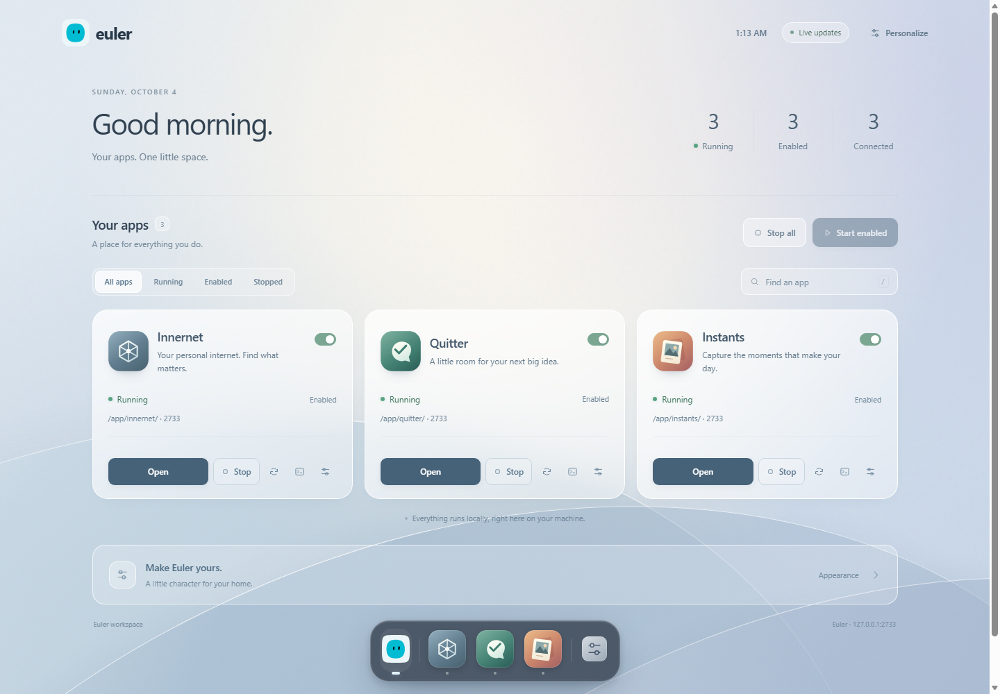
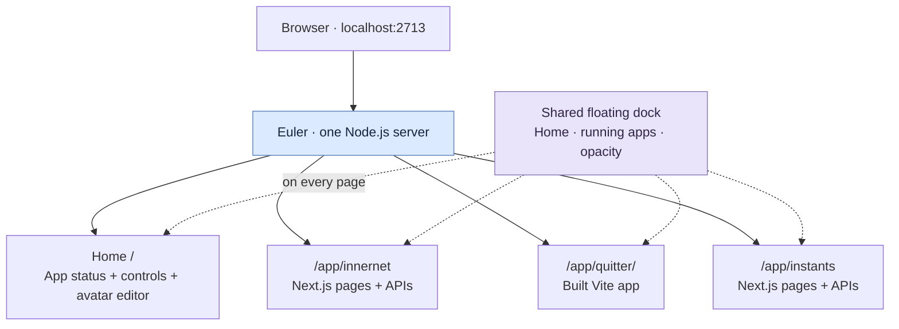

<p align="center">
  
</p>

<h1 align="center">Euler</h1>
<p align="center"><strong>Your apps. One home. One dock.</strong></p>
<p align="center">
  <a href="https://github.com/quirq-ai/euler/actions/workflows/check.yml"></a>
</p>

Euler brings **Innernet**, **Quitter**, and **Instants** into one local workspace at **http://localhost:2713**. Switch apps from a floating dock, turn them on or off, and make Euler your own with a customizable avatar.

[Quick start](#quick-start) · [How it works](#how-it-works) · [Deploy](#deployment) · [Development](#development) · [Data and settings](#data-and-settings)



*Home brings app status, launch controls, enabled settings, and the avatar editor together. Saving an avatar updates Euler's logo and the dock's Home icon; app icons keep their identities.*

## Quick start

Install **Node.js 24** and Git. Node 22.13 or newer is supported. These commands work on **Windows, macOS, and Linux**:

```sh
git clone https://github.com/quirq-ai/euler.git
cd euler
npm ci
npm run setup
npm run build
npm start
```

Open **http://localhost:2713**. All three bundled apps are enabled initially; Home stays available. Stop Euler with **Ctrl+C** in its terminal; closing the browser tab leaves it running.

| Step | What it does |
| --- | --- |
| `npm ci` | Installs the root Nx and package-manager tools. |
| `npm run setup` | Installs the bundled apps from their committed lockfiles; Home needs no dependencies. |
| `npm run build` | Validates Home and compiles enabled apps for their `/app/<name>` routes. |
| `npm start` | Starts one HTTP server and mounts the enabled builds. |

The app sources and routing changes are already included. No sibling repositories or patch-preparation step is required. For another port, use `npm start -- --port 2800`.

## How it works



Apps render directly under Euler's address. Their page, asset, and API URLs stay within their own prefix; for example, Innernet's suggestions endpoint is `/app/innernet/api/suggest`. Euler dispatches to prepared Next.js handlers or built static files inside the same process.

The dock is added to HTML pages. API responses, assets, and React server component streams retain their original content. Switching uses normal links, enhanced by native document transitions where supported. The dock remembers each tab's last app route and window scroll position; arbitrary unsaved forms or component state may reset when navigating.

### Use the workspace

| Control | Behavior |
| --- | --- |
| **Home** | See app status and counts, launch and manage apps, and customize Euler's avatar. |
| **Dock appearance** | Adjust the glass background opacity from 20–100%. |
| **App On / Off switch** | Apply availability immediately and remember it for startup and default builds. |
| **Settings** | Edit **Enable in Euler**, then choose **Save settings** to apply it. |
| **Start / Stop** | Mount or unmount an app's existing build. |
| **Restart** | Reactivate the prepared build. Source changes still require rebuilding. |
| **Logs** | Inspect recent lifecycle output and errors. |
| **Start enabled / Stop all** | Control the workspace's app routes together. |
| **Search and filters** | Find apps by name or show running, enabled, or stopped apps. |

Each app's status dot and controls are together on Home. Enabled settings persist across sessions; stopping an app affects its current running state. The dock shows running apps and stays available on Home and app pages. Older `/manage` links redirect to the [applications section](http://localhost:2713/#applications) on Home.

Choose **Personalize** or expand **Make Euler yours.** below the apps to open the avatar editor. App refreshes preserve any avatar draft you are editing.

Use **Alt+0** for Home, **Alt+1…9** for running apps, and arrow keys to move between focused dock items. Reduced-motion preferences are respected.

## Deployment

**Choose whether you need the complete Euler workspace or an independently hosted app.** The current Euler host is designed for loopback access and local persistent storage. The deployment options below reflect that implementation.

| Destination | What works with this repository | Instructions |
| --- | --- | --- |
| Your Windows, macOS, or Linux machine | Complete Euler workspace | [Quick start](#quick-start) |
| Linux VM / VPS with SSH and persistent disk | Complete Euler workspace through a private SSH tunnel | [Full Euler on a server](#full-euler-on-a-linux-server) |
| Vercel | Separate Quitter, Innernet demo, and Instants browser-session deployments | [Vercel](#vercel-individual-apps) |
| Netlify / Cloudflare Pages | Standalone Quitter static app | [Static hosts](#netlify-and-cloudflare-pages) |
| Public container/PaaS services | Full Euler needs a hosting adapter first | [Public hosting limits](#public-hosting-limits) |

### Full Euler on a Linux server

Use a persistent Linux VM with Node 24, Git, and SSH access: for example, a DigitalOcean Droplet, Hetzner VM, AWS EC2 instance, or your own Linux server. Run as a normal account. Innernet indexes files on **that server**, not files on the computer viewing it.

1. Connect over SSH and run the [quick-start commands](#quick-start) on the server. Keep Euler's port bound to loopback.
2. In a terminal on your own computer, open a tunnel:

   ```sh
   ssh -N -o ExitOnForwardFailure=yes -L 127.0.0.1:2713:127.0.0.1:2713 user@your-server
   ```

3. Browse **http://127.0.0.1:2713** on your computer. Keep the tunnel open while using Euler. You only need SSH exposed by the server; port 2713 stays private.

The forwarded port must match Euler's configured port because its request checks include the port. Stop another local Euler instance before opening this tunnel, or choose the same alternate port on both ends. See [OpenSSH local forwarding](https://man.openbsd.org/ssh#L).

<details>
<summary><strong>Keep Euler running with systemd</strong></summary>

On a Linux system with a systemd user session, first stop any foreground Euler process. Run the following from the built repository's root. The unit captures the current checkout and Node paths, including version-manager installations:

```sh
mkdir -p ~/.config/systemd/user
cat > ~/.config/systemd/user/euler.service <<EOF
[Unit]
Description=Euler app workspace
After=network.target

[Service]
Type=simple
WorkingDirectory=$PWD
ExecStart="$(command -v node)" "$PWD/bin/euler.mjs"
Environment=NODE_ENV=production
Restart=on-failure
RestartSec=5

[Install]
WantedBy=default.target
EOF
systemctl --user daemon-reload
systemctl --user enable --now euler
```

To keep the user service running after logout, an administrator can enable lingering for your account:

```sh
sudo loginctl enable-linger "$(id -un)"
```

Useful commands:

```sh
systemctl --user status euler
journalctl --user -u euler -f
systemctl --user stop euler
systemctl --user start euler
```

If you change the Node installation path, regenerate the unit and reload it. Reference: [systemd service units](https://www.freedesktop.org/software/systemd/man/latest/systemd.service.html).

</details>

For updates, stop the service, run `git pull --ff-only`, `npm ci`, `npm run setup`, and `npm run build` in the checkout, then start the service. Preserve the [data directories](#data-and-settings) across updates and backups.

### Vercel: individual apps

**The complete Euler host is not currently supported as a Vercel deployment by this repository.** The app folders can be deployed as separate Vercel projects. Each gets its own URL and standalone app behavior; the Euler Home, shared dock, and host controls are not part of those deployments.

Import `quirq-ai/euler` once for each app you want. Select production branch **`main`**, Node **24.x**, and the following settings. Root Directory is relative to the Git repository; build/output paths are relative to that app directory.

| App | Root Directory | Framework | Install command | Build command | Output |
| --- | --- | --- | --- | --- | --- |
| Quitter | `app/quitter` | Vite | `npm ci` | `npm run build` | `dist` |
| Innernet | `app/innernet` | Next.js | `npx --yes pnpm@9.12.3 install --frozen-lockfile` | `npm run build` | Next.js default |
| Instants | `app/instants` | Next.js | `npm ci` | `npm run build` | Next.js default |

Use each app's build script, not the repository-root Euler build command. Leave `QUIRQ_BASE_PATH`, `QUIRQ_DIST_DIR`, `INNERNET_BASE_PATH`, `INNERNET_DIST_DIR`, `INSTANTS_BASE_PATH`, and `INSTANTS_DIST_DIR` unset: standalone deployments use `/` and their normal build output. Clear stale framework/output overrides when reusing an old Vercel project.

Keep **Enable access to System Environment Variables** turned on in the Vercel project's Environment Variables settings. Innernet and Instants use Vercel's `VERCEL` variable to select their hosted behavior. See [Vercel system environment variables](https://vercel.com/docs/environment-variables/system-environment-variables#enable-system-environment-variables).

- **Quitter:** deploys its in-memory demonstration UI. It has no production collaboration backend.
- **Innernet:** Vercel selects public demo mode and uses the committed `data/demo/index.json`. It does not index your computer. No database is needed for the bundled demo; optional Neon configuration is described in the [Innernet README](app/innernet/README.md#the-public-demo-vercel).
- **Instants:** on Vercel, the existing adapter keeps the session journal in browser storage. It is a device-local prototype, not shared team persistence. See the [Instants README](app/instants/README.md#deploy-to-vercel).

After deployment, open the app, inspect browser/network errors, and refresh a nested route. For Instants, make a sample change and refresh to confirm browser persistence. Hosting instructions are provided here; this repository does not provision your Vercel projects or credentials.

Reference: [Vercel monorepos](https://vercel.com/docs/monorepos) and [build configuration](https://vercel.com/docs/builds/configure-a-build).

### Netlify and Cloudflare Pages

Quitter is a static Vite app, so it can also be published independently:

| Setting | Netlify | Cloudflare Pages |
| --- | --- | --- |
| Repository | `quirq-ai/euler` | `quirq-ai/euler` |
| Production branch | `main` | `main` |
| Base / root directory | `app/quitter` | `app/quitter` |
| Build command | `npm run build` | `npm run build` |
| Publish / output directory | `dist` | `dist` |
| Build Node version | `NODE_VERSION=24` | `NODE_VERSION=24` |

Set Netlify's **Base directory** explicitly to `app/quitter`, so dependencies are installed there; it is not enough to select only its Package directory. The publish directory is relative to that base. Keep `QUIRQ_BASE_PATH` and `QUIRQ_DIST_DIR` unset. These deployments do not include Euler's Node server, dock, or the two Next.js apps.

Reference: [Netlify monorepo settings](https://docs.netlify.com/build/configure-builds/monorepos/) and [Cloudflare Pages build settings](https://developers.cloudflare.com/pages/configuration/build-configuration/).

### Public hosting limits

Euler currently binds to `127.0.0.1`, accepts loopback Host/Origin values, and stores enabled settings and app data on local disk. It has no user-account or multi-tenant authentication layer. Setting a provider's `PORT` variable alone does not configure this host; use its explicit `--port` option for private deployments.

A full public deployment on Vercel, Render, Railway, Fly.io, or another container/function platform needs an intentional adapter: public-address and origin handling, authentication, durable app storage, and a deployment lifecycle suitable for the host's in-process Next runtimes. This repository does not yet supply that adapter or a ready-to-deploy container image. Use the private VM recipe for complete Euler today.

## Development

The repository owns its manifest and app sources:

```text
euler/
├── bin/euler.mjs           # executable
├── euler.workspace.json   # apps and build commands
├── nx.json                # task orchestration
├── src/                   # HTTP host, builds, settings, app lifecycle
├── app/
│   ├── home/               # all Euler UI; Home served at /
│   │   ├── public/        # Home, dock, avatar, icons, Blobatar
│   │   ├── src/           # dock document integration
│   │   ├── server.mjs     # Home assets, routes, document hooks
│   │   └── tests/         # Home and shared UI tests
│   ├── innernet/           # Next.js
│   ├── quitter/            # Vite + React
│   └── instants/           # Next.js
└── tests/                 # host regression tests
```

| Command | Purpose |
| --- | --- |
| `npx nx show projects` | List the host, Home, and three bundled app projects. |
| `npx nx run euler-app:start` | Start Euler. |
| `npx nx run euler-app:build` | Validate Home and build enabled apps. |
| `npx nx run euler-home:dev` | Start Home through the Euler host at port 2713. |
| `npx nx run euler-home:build` | Validate Home's browser-ready source files. |
| `npx nx run euler-home:test` | Run the focused Home tests. |
| `npx nx run euler-innernet:build` | Build Innernet for its Euler route. |
| `npx nx run euler-quitter:dev` | Start standalone Quitter development. |
| `npm run setup -- home` | Confirm Home needs no dependency installation. |
| `npm run build -- --app home` | Validate Home without building the other apps. |
| `npm run build -- --app instants` | Build one app even if disabled; leave its enabled setting unchanged. |
| `npm test` | Run the host and Home test suites. |

You can also `cd app/quitter` and run `npm run dev`, or use the other apps' own commands. Standalone development uses the app's original port and root path. Euler builds go into `.next-euler` or `dist-euler` to keep development output separate. Stop Euler before rebuilding a build it is serving.

Home is a first-class local app in [`app/home`](app/home/README.md). From that folder, `npm run dev` or `npm start` launches the same Euler host, API, and enabled apps at **http://localhost:2713/**. Stop an existing Euler process before starting another on that port. `npm run build` validates Home's HTML, CSS, and JavaScript, and `npm test` runs its focused tests. Home uses browser-ready source with no app dependencies or generated bundle; Nx also exposes its `start` and `setup` targets.

Home stays available as Euler's control surface, so it has no enable switch or upstream repository to synchronize. All Euler UI belongs to `app/home`, including the dock, avatar renderer, icons, vendored Blobatar, and the integration that adds the dock to app pages. The repository root handles hosting, security, builds, configuration, and app lifecycle. Hosting Home requires the full Euler host described in [Deployment](#deployment).

`npm start` resolves `euler.workspace.json` from this repository, regardless of your terminal's current directory. Use `--workspace /path/to/euler` or `--config /path/to/euler.workspace.json` to choose a custom installation. Nx runtime/build targets disable caching because local settings and data affect their behavior.

Already have an older checkout with sources in `apps/`? Stop Euler and follow the [folder migration instructions](docs/app-updates.md#upgrade-from-the-apps-folder) to preserve local app data, then reinstall and rebuild under `app/`. Existing hosting projects must also update their app Root Directory or Base directory to the paths above.

### Update an app from its upstream repository

App updates are manual. Innernet, Quitter, and Instants keep their own repositories; Euler tracks their sources as Git subtrees under `app/`. Ordinary cloning, setup, and builds are unchanged.

Commit your local Euler changes first, then run these commands from the repository root:

```sh
npm run apps:check
npm run apps:sync -- innernet
npm run setup -- innernet
npm run build -- --app innernet
npm test
```

`apps:check` fetches upstream information without changing app files. `apps:sync` merges **one app at a time** and creates a local Euler commit containing its source changes and updated upstream pin. Replace `innernet` with `quitter` or `instants` as needed. Stop Euler before rebuilding an app it is serving.

If a merge conflicts, resolve the files, stage them with `git add`, then run `npm run apps:sync -- --continue`; use `npm run apps:sync -- --abort` to cancel that merge. After validation, push your Euler branch through your normal workflow. These commands do not push changes to the standalone app repositories or schedule future updates. See the [app maintenance guide](docs/app-updates.md) for the full workflow and recovery steps.

## Data and settings

| Data | Stored in | Lifetime |
| --- | --- | --- |
| Enabled apps | `.workspace-state/euler/config.json` | Across server restarts |
| Innernet local index | `app/innernet/data/*.json` | On the host machine |
| Innernet local database | `~/.innernet/db` by default | On the host machine; optional `INNERNET_DB_DIR` override |
| Innernet local history | `~/.innernet/history` by default | On the host machine; optional `INNERNET_HISTORY_DIR` override |
| Instants local journals | `app/instants/session/<id>/session.json` | On the host machine |
| Avatar and dock opacity | Browser local storage | Per browser and origin |
| Last route and scroll | Browser session storage | Per browser tab |

Keep a persistent disk for server-hosted Euler and back up local data with the service stopped. Fresh clones contain source and bundled public demo material, not your personal index or journals. Browser preferences use separate storage when the host or port changes.

## Project notes

- This repository is [quirq-ai/euler](https://github.com/quirq-ai/euler). It replaces the older Python watcher with the standalone app workspace.
- The original iframe-based quirq dashboard remains separate on [quirq-ai/quirq's `feat/standalone-dashboard`](https://github.com/quirq-ai/quirq/tree/feat/standalone-dashboard), at port 4400.
- In the larger local quirq workspace, `npm run euler` starts `apps/euler`, while `npm start` opens the separate dashboard. This repository also works as a fresh independent clone.
- [Source provenance](app/upstream.json) records imported app revisions and adapters. [Architecture](docs/architecture.md) and the [user guide](docs/euler.md) explain the host in more detail.
- Blobatar is vendored locally under its MIT license in [app/home/public/vendor/blobatar](app/home/public/vendor/blobatar). Avatar rendering and saving do not contact an external service.
- [CI](https://github.com/quirq-ai/euler/actions/workflows/check.yml) runs host tests on Node 22/24 and application builds on Node 24 across Windows, macOS, and Linux.
