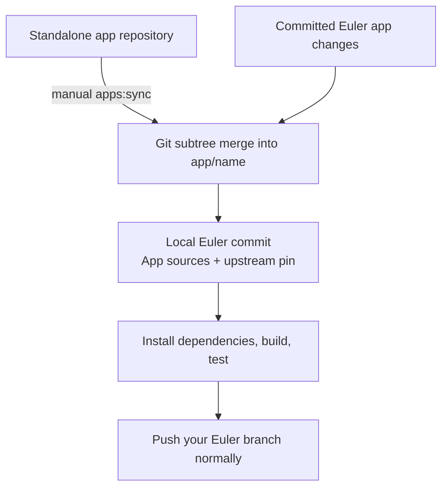

# Maintaining Euler's app sources

Euler includes Innernet, Quitter, and Instants as ordinary tracked directories under
`app/`. Each directory is a Git subtree connected to its standalone upstream
repository. You choose when to check for updates and which app to merge.

A normal clone already contains the app sources. `npm ci`, `npm run setup`, builds,
and startup do not synchronize source repositories. There are no submodule
initialization steps or runtime patches to apply.

## Upgrade from the `apps/` folder

New clones already use `app/`. For an existing installation, stop Euler and any
standalone app servers, finish any pending app synchronization, and commit the
source changes you want to keep before updating. Back up your local app data.

Run from the Euler repository root on Windows, macOS, or Linux:

```sh
git pull --ff-only
npm run migrate:app-data
npm ci
npm run setup
npm run build
npm start
```

Git moves the tracked source files. The migration command moves local app data
left in the old `apps/<name>` directories to matching paths under `app/<name>`.
It preserves local environment files, Innernet indexes, Instants journals, and
other files that are not generated. Before moving any files, it checks all
destinations and refuses collisions, unknown old app directories, and data
symlinks or junctions. It skips generated dependencies and build output; setup
and build recreate those in the new paths. Use
`npm run migrate:app-data -- --dry-run` to preview the migration. Fresh clones
and repeated migrations have nothing to move. Existing `.workspace-state`
settings and browser preferences keep their locations.

If the command reports a collision, compare and back up both copies before
resolving it and rerunning the command. The helper does not overwrite either copy
or remove the old directory; skipped generated artifacts remain there. Update
any hosting project's app Root Directory or Base directory, custom manifests,
editor tasks, and external scripts from
`apps/<name>` to `app/<name>`. App URLs and the `apps:check` / `apps:sync` commands
stay the same.

## How synchronization works



## Commands

Run these from the Euler repository root, using the same Git and Node installation
as your normal development workflow. Git must include `git subtree`, and Euler
needs the history from a normal, non-shallow clone so the previous subtree import
can be found. The [quick-start clone](../README.md#quick-start) includes that history.

Check subtree availability with `git subtree -h`. If it is unavailable, install a
full Git distribution for your platform. App startup and builds do not require
this command.

| Command | Effect |
| --- | --- |
| `npm run apps:check` | Fetch and report updates for all three apps. |
| `npm run apps:check -- innernet` | Check one app. |
| `npm run apps:check -- all` | Explicitly check all apps. |
| `npm run apps:sync -- innernet` | Merge one app's upstream branch and create a local Euler commit. |
| `npm run apps:sync -- --continue` | Finish a synchronization after resolving and staging conflicts. |
| `npm run apps:sync -- --abort` | Cancel the active synchronization merge. |
| `npm run apps:sync -- --help` | Show command help. |

Valid app names are `innernet`, `quitter`, and `instants`. Synchronize one app at a
time; there is no `apps:sync -- all` operation.

## Check and update

1. **Commit your local changes in Euler.** Check `git status` and commit the work
   you intend to keep, including edits inside `app/`. The synchronization command
   requires a clean working tree, including untracked files that Git does not
   ignore. It does not stash changes for you or interrupt another merge or rebase.

2. **Check the upstream repositories.**

   ```sh
   npm run apps:check
   ```

   The check fetches each configured upstream branch and reports the pinned and
   latest commits. It updates local Git references under
   `refs/euler/upstream/<app>`, without editing app files or the recorded pin.
   Checking requires network access and any Git credentials needed by the
   upstream repository. It does not require separate sibling checkouts.

3. **Merge the app you want to update.** For example:

   ```sh
   npm run apps:sync -- innernet
   ```

   Euler merges upstream changes with the changes already committed in its app
   directory. A successful update creates a local commit containing the merged
   source and the new pin in `app/upstream.json`. It does not install dependencies,
   build apps, restart Euler, or push to a remote. If the app is already current,
   there is nothing to merge.

4. **Validate the updated app.** Stop Euler before rebuilding an app it is
   currently serving. For the same app:

   ```sh
   npm run setup -- innernet
   npm run build -- --app innernet
   npm test
   ```

   The single-app build works even when that app is disabled and leaves its enabled
   setting unchanged. Run any additional app-specific checks relevant to the
   changes. Start Euler again with `npm start`, open the updated app, and check its
   pages, assets, and API behavior under `/app/innernet`.

5. **Review and publish through Euler.** Inspect the local commit and test results,
   then use your normal commit, branch, pull-request, and push workflow for the
   Euler repository. Make any follow-up fixes as ordinary Euler commits.

Repeat these steps with `quitter` or `instants` when you want to update them.

## Resolve a merge conflict

Upstream changes can touch the same lines as Euler's subpath adapters or other
local app changes. The command pauses with a normal Git merge in progress so you
can review and resolve those conflicts.

For an Innernet synchronization:

```sh
git status
```

Edit the conflicted files, remove the conflict markers, and preserve the intended
upstream behavior together with Euler's `/app/innernet` integration. Stage the
resolved app files and let the synchronization command finish its commit:

```sh
git add app/innernet
npm run apps:sync -- --continue
```

Use the matching app directory for a Quitter or Instants update. Resolve and stage
all conflicted files in that app. Keep unrelated changes out of this pending
update. Use the wrapper's `--continue` so the source merge and recorded upstream
revision are finalized together. Then run the setup, build, and test steps above.

To abandon the active synchronization instead:

```sh
npm run apps:sync -- --abort
```

Aborting cancels that pending merge and its conflict-resolution work. The Euler
changes you committed before starting it remain in history. The command only
aborts a synchronization it owns; it does not cancel an unrelated Git operation.

If synchronization stops after Git has already created its merge commit, use
`--continue` to finish recording the upstream pin. Keep that commit at `HEAD`
until recovery finishes; make further changes afterward. `--abort` never resets
an already-created commit.

If the process stops after Git creates the merge commit but before the upstream
pin is finalized, use `--continue` to complete it. At that point `--abort` refuses
to reset a committed update. Avoid committing unrelated work until recovery is
finished.

## What stays independent

The standalone repositories remain independently maintained:

| Euler directory | Upstream repository |
| --- | --- |
| `app/innernet` | [quirq-ai/innernet](https://github.com/quirq-ai/innernet) |
| `app/quitter` | [quirq-ai/quitter](https://github.com/quirq-ai/quitter) |
| `app/instants` | [quirq-ai/instants](https://github.com/quirq-ai/instants) |

Edits committed directly in Euler stay in Euler. These commands never send them
back to an upstream app repository. To contribute a change upstream, use that
repository's own development and review workflow. Conversely, an upstream commit
only enters Euler when you explicitly synchronize it and publish the resulting
Euler commit. There is no automatic update schedule.

Running `git pull` in an Euler clone retrieves changes already published to Euler;
it does not independently pull every app's upstream branch.

## Revision records and unexpected history

If Euler was cloned with `--depth` or by a tool that creates shallow clones, check
whether its history is incomplete:

```sh
git rev-parse --is-shallow-repository
```

If that prints `true`, fetch the missing Euler history from its usual `origin`
remote, then retry the update command:

```sh
git fetch --unshallow origin
```

This fetch restores the history needed to locate the subtree baseline; it does
not synchronize any app's source files. Use the corresponding Euler remote name
if your clone calls it something other than `origin`.

[`app/upstream.json`](../app/upstream.json) records each upstream repository,
branch, and current integrated revision in `upstream.commit`. Its tracked-file and
byte counts describe that upstream revision. Synchronization advances those
current revision fields as part of its local commit.

The original import revision remains in `import.importedCommit`. Historical
adapter descriptions, source URLs, and hashes describe the original import; they
are provenance, not patches to replay during an update. Euler's adapter code and
Nx files are regular source files maintained through Git merges.

The synchronization command checks the subtree baseline and refuses an upstream
rewind or divergent history. If it reports either condition, inspect the upstream
history and the recorded pin before attempting another update. Do not change
`upstream.commit` by hand to bypass the check. Normal fast-forward upstream
development and ordinary merge conflicts use the workflow above.

Local indexes, journals, and browser preferences are separate from source
synchronization. Continue to back them up as described in
[Data and settings](../README.md#data-and-settings).
